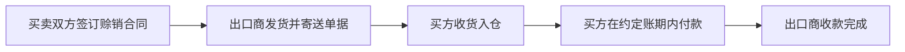

赊销（Open Account, O/A）是国际贸易中常见的信用销售方式，指出口商先发货、买方后付款的交易模式（通常付款期为 30-180 天）。其核心是**基于信任的信用授予**，对出口商风险较高但能增强买方合作意愿。以下是赊销业务的系统解析：

---

### **一、赊销的运作流程**



**关键环节**：

1. **信用评估**：出口商需调查买方资信（历史付款记录、财务实力、国家风险等）。
2. **合同条款**：明确付款期限（如 Net 90）、逾期罚息、货物所有权保留条款。
3. **单据流转**：商业发票+提单副本直接寄买方（区别于信用证交单）。
4. **收款跟进**：账期到期前催收，依赖买方主动付款。

---

### **二、赊销的四大核心风险**

| **风险类型**     | **具体表现**             | **应对措施**                   |
| ---------------- | ------------------------ | ------------------------------ |
| **买方信用风险** | 破产、拖欠、恶意拒付     | 投保出口信用保险、无追索权保理 |
| **国家风险**     | 外汇管制、战争、进口禁令 | 利用 ECA（出口信用机构）担保   |
| **汇率风险**     | 账期内汇率波动导致汇损   | 远期锁汇、货币互换             |
| **资金压力**     | 货款回收前现金流紧张     | 保理融资、供应链金融           |

---

### **三、赊销的适用场景**

1. **买方市场主导**：当进口商要求更宽松的付款条件（如消费品行业竞争激烈）。
2. **长期稳定合作**：买卖双方有多年信任基础（如跨国集团内部交易）。
3. **高附加值产品**：利润率足以覆盖潜在风险成本（如定制化设备）。
4. **供应链强管控**：出口商在买方国有本地催收团队或法律保障。

> 💡 **案例**：  
> 中国服装厂向美国超市出口货物，约定**Net 60 赊销**。超市凭提单副本提货销售，60 天后付款。出口商通过**无追索权保理**立即获得 80%货款，保理商承担超市破产风险。

---

### **四、赊销的利弊分析**

| **优势**                          | **劣势**                        |
| --------------------------------- | ------------------------------- |
| ✅ 提升买方采购意愿（无预付压力） | ❌ 出口商承担 100%信用风险      |
| ✅ 简化交易流程（无需信用证开立） | ❌ 资金占用周期长（影响现金流） |
| ✅ 降低买方交易成本（无银行费用） | ❌ 催收成本高（跨境追讨困难）   |
| ✅ 增强长期客户黏性               | ❌ 需自行管理应收账款           |

---

### **五、风控关键工具**

1. **出口信用保险**（如中国信保）：

   - 保障范围：买方破产+拖欠+政治风险
   - 赔付比例：通常 90%-95%
   - 操作：投保后可将赔款权益转让给银行融资

2. **无追索权保理**：

   ```mermaid
   graph TB
   出口商-->|转让应收账款| 保理商
   保理商-->|预付80%-90%货款| 出口商
   买方-->|到期付款至保理商| 保理商
   保理商-->|支付剩余货款| 出口商
   ```

   - 保理商承担买方信用风险
   - 融资利率：LIBOR/SOFR + 3%-6%

3. **供应链金融科技**：
   - 区块链平台验证贸易真实性（如 Contour、Marco Polo）
   - AI 资信评估工具实时监控买方风险（如 CrediWatch、Atradius 报告）

---

### **六、赊销 vs 其他结算方式**

| **方式**      | 风险承担方 | 成本              | 适用场景           |
| ------------- | ---------- | ----------------- | ------------------ |
| 赊销(O/A)     | 出口商     | 低（无银行费）    | 信任度高、买方强势 |
| 信用证(L/C)   | 开证行     | 高（1%-5%交易额） | 新客户、高风险国家 |
| 预付款(T/T)   | 进口商     | 极低              | 小金额/样品单      |
| 承兑交单(D/A) | 出口商     | 中等（托收费）    | 中长期付款需求     |

---

### **七、企业实操建议**

1. **信用管理铁律**：

   - 新客户：严格限制赊销额度（≤ 年交易额 10%）
   - 老客户：动态调整额度（每季度复审财务报告）

2. **条款设计技巧**：

   - 添加**滞纳金条款**（如逾期按 0.05%/日罚息）
   - 约定**货物所有权保留**（Until Full Payment 条款）

3. **组合金融工具**：
   ```plaintext
   赊销合同 + 中国信保保单 + 银行保理融资
   → 实现：风险转移 + 当天回款80% + 出表优化财报
   ```

> 🌐 **趋势**：2023 年全球赊销贸易占比达 65%（ICC 数据），但新兴市场交易中**“赊销+保险”** 已成标配。中小企业可借助数字化平台（如阿里国际站信保服务）快速获得风控支持。

如果需要具体行业的赊销合同模板或中国信保操作指南，可进一步说明！
