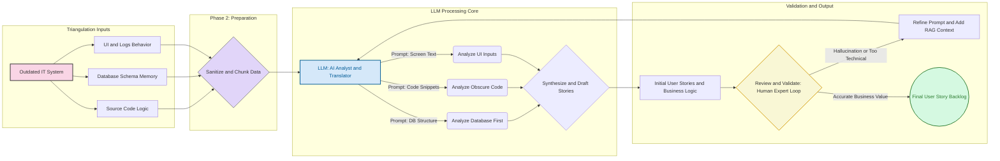

Recovering user stories from an outdated legacy system written in an obscure language is a classic "Software Archaeology" challenge. This process is often called **Reverse Engineering for Requirements**.

Because few people understand the language, you cannot rely on manual code reading alone. You must use the LLM as a "translator" and "business analyst" simultaneously.

Here is a structured approach to analyzing your system and extracting user stories using an LLM.

---

### Phase 1: The Strategy (Triangulation)

To get accurate user stories, you cannot look at the code in isolation. You need to feed the LLM three different types of inputs to triangulate the truth:

1.  **The Logic (Source Code):** Tells you _how_ it processes data.
2.  **The Memory (Database Schema):** Tells you _what_ entities matter (e.g., Customers, Invoices).
3.  **The Behavior (UI/Logs):** Tells you _when_ and _why_ users interact with it.

---

### Phase 2: Step-by-Step Execution Guide

#### Step 1: Prepare Your Data (Sanitization & Chunking)

LLMs have a "context window" (limit on how much text they can read at once). You cannot paste the entire system at once.

- **Map the Modules:** Identify the folder structure. Group files by function (e.g., `billing`, `inventory`, `reporting`).
- **Sanitize:** **Crucial.** Remove passwords, API keys, and real customer PII (Personally Identifiable Information) before feeding anything to an AI. Replace them with placeholders like `[REDACTED_API_KEY]`.

#### Step 2: The "Database First" Approach

The database is often easier to understand than obscure code.

- **Action:** Export your database schema (table names, column names, foreign keys) to a text file.
- **LLM Prompt:**
  > "I have a database schema for a legacy system. Based on these table names and relationships, identify the core business entities and suggest 5 high-level user stories that this system likely supports."

#### Step 3: Analyzing the "Obscure" Code

Since the language is rare, you need to provide the LLM with context.

- **Action:** Take a specific file (e.g., a script that runs every night).
- **LLM Prompt:**
  > "I am uploading a code snippet written in [Language Name]. Please explain this code in plain English. Focus on the **business logic** (what data is being changed?) rather than the syntax. Then, convert this logic into a User Story in the format: 'As a [Role], I want to [Action], so that [Benefit]'."

#### Step 4: Analyze User Interfaces (Screens/Inputs)

If the system has a screen (green screen, command line, or old GUI), this is the gold mine for user stories.

- **Action:** Take screenshots or copy the text of the input fields.
- **LLM Prompt:**
  > "Here is the text layout of a screen in our legacy system. It asks for 'CustID', 'PartNo', and 'Qty'. What is the user likely doing here? Write a user story for this screen."

---

### Phase 3: Advanced LLM Techniques for this Task

If the system is large, simple copy-pasting won't work. Use these techniques:

#### 1\. Retrieval-Augmented Generation (RAG)

If you are technical, do not paste code into a chat window. Instead:

- Use a tool like **Cursor**, **GitHub Copilot**, or a local LLM setup (like **Ollama** with a vector database).
- Index your entire codebase.
- You can then ask the LLM questions like: _"Search the codebase for where 'Monthly_Interest' is calculated and tell me the user story associated with it."_

#### 2\. The "Role-Playing" Prompt

To get better results, set a "System Prompt" for the LLM:

> **System Prompt:** "You are an expert Senior Business Analyst and Legacy Code Migration Specialist. Your job is to read code written in [Language X] and reverse-engineer the functional requirements. You prioritize business value over technical implementation details."

---

### Phase 4: Example Analysis Workflow

Let's say you have a snippet of code in an old language (like COBOL or RPG) that calculates a discount.

**1. Input to LLM:**

```text
IF CUST-TYPE = 'VIP' AND ORDER-AMT > 1000 THEN
   COMPUTE DISC-AMT = ORDER-AMT * 0.10
ELSE
   COMPUTE DISC-AMT = 0
END-IF
```

**2. Prompt to LLM:**
"Analyze this logic. Who is the actor? What is the trigger? Draft a user story."

**3. Expected LLM Output:**

- **Analysis:** The code checks if a customer is a VIP and spending over 1000. If so, it gives a 10% discount.
- **User Story:** "As a **VIP Customer**, I want to **receive a 10% discount automatically when I spend over $1000**, so that **I feel rewarded for my loyalty.**"

---

### Phase 5: Risks and Watchouts

- **Hallucinations:** If the language is _very_ obscure (e.g., a proprietary language used by only one company in the 1980s), the LLM might guess the syntax incorrectly. Always verify the logic with a developer if possible.
- **Business Logic vs. Technical Debt:** The LLM might write a story about "Running a batch job at midnight." That is a _technical_ task, not a user story. You must ask the LLM to "Abstract away the technical implementation."
- **Security:** Never upload proprietary code to a public LLM (like free ChatGPT) unless your company policy allows it. Use "Enterprise" versions or run local LLMs (like Llama 3) for privacy.

### Would you like me to help you design a specific prompt for your first batch of code, or would you like to discuss tools for indexing your codebase (RAG)?


